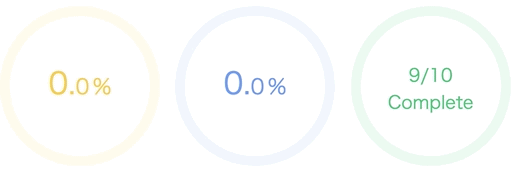
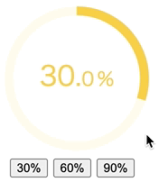

[](https://www.webcomponents.org/element/progress-ring-component)
![Built With Stencil](https://img.shields.io/badge/-Built%20With%20Stencil-16161d.svg?logo=data%3Aimage%2Fsvg%2Bxml%3Bbase64%2CPD94bWwgdmVyc2lvbj0iMS4wIiBlbmNvZGluZz0idXRmLTgiPz4KPCEtLSBHZW5lcmF0b3I6IEFkb2JlIElsbHVzdHJhdG9yIDE5LjIuMSwgU1ZHIEV4cG9ydCBQbHVnLUluIC4gU1ZHIFZlcnNpb246IDYuMDAgQnVpbGQgMCkgIC0tPgo8c3ZnIHZlcnNpb249IjEuMSIgaWQ9IkxheWVyXzEiIHhtbG5zPSJodHRwOi8vd3d3LnczLm9yZy8yMDAwL3N2ZyIgeG1sbnM6eGxpbms9Imh0dHA6Ly93d3cudzMub3JnLzE5OTkveGxpbmsiIHg9IjBweCIgeT0iMHB4IgoJIHZpZXdCb3g9IjAgMCA1MTIgNTEyIiBzdHlsZT0iZW5hYmxlLWJhY2tncm91bmQ6bmV3IDAgMCA1MTIgNTEyOyIgeG1sOnNwYWNlPSJwcmVzZXJ2ZSI%2BCjxzdHlsZSB0eXBlPSJ0ZXh0L2NzcyI%2BCgkuc3Qwe2ZpbGw6I0ZGRkZGRjt9Cjwvc3R5bGU%2BCjxwYXRoIGNsYXNzPSJzdDAiIGQ9Ik00MjQuNywzNzMuOWMwLDM3LjYtNTUuMSw2OC42LTkyLjcsNjguNkgxODAuNGMtMzcuOSwwLTkyLjctMzAuNy05Mi43LTY4LjZ2LTMuNmgzMzYuOVYzNzMuOXoiLz4KPHBhdGggY2xhc3M9InN0MCIgZD0iTTQyNC43LDI5Mi4xSDE4MC40Yy0zNy42LDAtOTIuNy0zMS05Mi43LTY4LjZ2LTMuNkgzMzJjMzcuNiwwLDkyLjcsMzEsOTIuNyw2OC42VjI5Mi4xeiIvPgo8cGF0aCBjbGFzcz0ic3QwIiBkPSJNNDI0LjcsMTQxLjdIODcuN3YtMy42YzAtMzcuNiw1NC44LTY4LjYsOTIuNy02OC42SDMzMmMzNy45LDAsOTIuNywzMC43LDkyLjcsNjguNlYxNDEuN3oiLz4KPC9zdmc%2BCg%3D%3D&colorA=16161d&style=flat-square)

# Progress Ring Component

This is an animated web component showing progress in percentage. It internally uses [easing-animation-frames](https://github.com/taisuke-j/easing-animation-frames) library to create CPU-friendly easing animations. This component is compiled with [Stencil](https://stenciljs.com/).

1. [Demo 1](https://unpkg.com/progress-ring-component@1.0.11/demo/demo-01.html)
1. [Demo 2](https://unpkg.com/progress-ring-component@1.0.11/demo/demo-02.html)
1. [Demo 3](https://unpkg.com/progress-ring-component@1.0.11/demo/demo-03.html)

## How to use



<!--
```
<custom-element-demo>
  <template>
    <script type="module" src="https://unpkg.com/progress-ring-component@1.0.11/dist/progressring/progressring.esm.js"></script>
    <script nomodule src="https://unpkg.com/progress-ring-component@1.0.11/dist/progressring/progressring.js"></script>
    <style>
      progress-ring { margin-right: 10px; font-family: sans-serif; }
      .completed-count { color: #30bf7a; font-size: 18px; }
    </style>
    <next-code-block></next-code-block>
  </template>
</custom-element-demo>
```
-->

```html
<progress-ring percentage="30"></progress-ring>
<progress-ring percentage="60" round-linecap="true"></progress-ring>
<progress-ring percentage="90" disable-digits="true">
  <p class="completed-count">9/10<br />Complete</p>
</progress-ring>
```

There is only one mandatory property, `percentage`, which declares the ending percentage in animation. You can also use `radius` prop to change the size of the ring, and `storkeWidth` to change the thickness of the ring. The full list of properties can be found below.

You can also place custom HTML elements within the component's `<progress-ring></<progress-ring>` tag as [HTMLSlotElement](https://developer.mozilla.org/en-US/docs/Web/API/HTMLSlotElement), which you have full control on for styling.

This component works reactively in a unidirectional fashion. When the `percentage` changes, it stops the current animation and resumes it with new percentage. There is pre-defined color scheme (`red (< 25%)` -> `yellow (< 50%)` -> `blue (< 75%)` -> `green (>= 75%)`).



<!--
```
<custom-element-demo>
  <template>
    <script type="module" src="https://unpkg.com/progress-ring-component@1.0.11/dist/progressring/progressring.esm.js"></script>
    <script nomodule src="https://unpkg.com/progress-ring-component@1.0.11/dist/progressring/progressring.js"></script>
    <style>
      progress-ring { margin-right: 10px; font-family: sans-serif; }
      .buttons { width: 150px; text-align: center; }
      button { margin-right: 10px; }
    </style>
    <next-code-block></next-code-block>
  </template>
</custom-element-demo>
```
-->

```html
<progress-ring percentage="10"></progress-ring>

<div class="buttons">
  <button id="buttonOne">30%</button>
  <button id="buttonTwo">60%</button>
  <button id="buttonThree">90%</button>
</div>

<script>
  const ring = document.querySelector("progress-ring");
  const buttonOne = document.querySelector("#buttonOne");
  const buttonTwo = document.querySelector("#buttonTwo");
  const buttonThree = document.querySelector("#buttonThree");

  buttonOne.addEventListener("click", () => {
    ring.setAttribute("percentage", 30);
  });
  buttonTwo.addEventListener("click", () => {
    ring.setAttribute("percentage", 60);
  });
  buttonThree.addEventListener("click", () => {
    ring.setAttribute("percentage", 90);
  });
</script>
```

### Properties

| Property         | Type    | Default        | Description                                 |
| ---------------- | ------- | -------------- | ------------------------------------------- |
| percentage       | number  | 0              | Percentage value (mandatory)                |
| radius           | number  | 80             | Radius of the ring                          |
| stroke-width     | number  | 10             | Thickness of the ring                       |
| round-linecap    | boolean | false          | Addes rounded linecap to the ring           |
| duration         | number  | 4000           | Animation duration in miliseconds           |
| easing-type      | string  | `quartInOut`   | Easing animation function name              |
| int-size         | number  | 30             | Font size of integer                        |
| decimal-size     | number  | intSize \* 0.7 | Font size of decimals                       |
| disable-digits   | boolean | false          | Hides digits                                |
| disable-decimals | boolean | false          | Hides decimal places                        |
| invert-colors    | boolean | false          | Inverts the color scheme                    |
| event-id         | string  | undefined      | Event Id to be used for animation callbacks |

#### Easing Types

`backInOut`, `backIn`, `backOut`, `bounceInOut`, `bounceIn`, `bounceOut`, `circInOut`, `circIn`, `circOut`, `cubicInOut`, `cubicIn`, `cubicOut`, `elasticInOut`, `elasticIn`, `elasticOut`, `expoInOut`, `expoIn`, `expoOut`, `linear`, `quadInOut`, `quadIn`, `quadOut`, `quartInOut`, `quartIn`, `quartOut`, `quintInOut`, `quintIn`, `quintOut`, `sineInOut`, `sineIn`, `sineOut`

### Advanced usage with animation events

By passing `even-id` as a prop, you can listen to events emitted by with the animation, and register callback functions for them. Please see [Demo 3](https://unpkg.com/progress-ring-component@1.0.11/demo/demo-03.html).


| Event Name  | Payload                         | Description                                                |
| ----------- | ------------------------------- | ---------------------------------------------------------- |
| prcProgress | `{ id: string, value: number }` | Event to be emitted on every progress change (from 0 to 1) |
| prcStart    | `{ id: string }`                | Event to be emitted when the animation starts              |
| prcComplete | `{ id: string }`                | Event to be emitted when the animation is completed        |
| prcStop     | `{ id: string }`                | Event to be emitted when the animation is stopped          |
| prcResume   | `{ id: string }`                | Event to be emitted when the animation is resumed          |
| prcRestart  | `{ id: string }`                | Event to be emitted when the animation is restarted        |

You can either directly import the component in script tag or integrate it into the framework you're using for the project.

### Script tag

Place a script tag `<script type="module" src="https://unpkg.com/progress-ring-component/dist/progressring/progressring.esm.js"></script>` in the head of your `index.html`.

```html
<!DOCTYPE html>
<html>
  <head>
    <script
      type="module"
      src="https://unpkg.com/progress-ring-component@1.0.11/dist/progressring/progressring.esm.js"
    ></script>
  </head>
  <body>
    <progress-ring percentage="50"></progress-ring>
  </body>
</html>
```

### Framework Integration

If you are integrating this component into a framework such as React or Vue, please see [Stencil doc](https://stenciljs.com/docs/overview) for information.

#### React

```ts
// index.js or index.tsx

import React from "react";
import ReactDOM from "react-dom";
import "./index.css";
import App from "./App";
import registerServiceWorker from "./registerServiceWorker";
import {
  applyPolyfills,
  defineCustomElements,
} from "progress-ring-component/dist/loader";

ReactDOM.render(<App />, document.getElementById("root"));
registerServiceWorker();

applyPolyfills().then(() => {
  defineCustomElements();
});
```

For Typescript, you may need additional type definitions so that `<progress-ring>` tag gets recognized.

```ts
import { HTMLAttributes } from "react";
import { JSX as LocalJSX } from "progress-ring-component/dist/loader";

type StencilToReact<T> = {
  [P in keyof T]?: T[P] &
    Omit<HTMLAttributes<Element>, "className"> & {
      class?: string;
    };
};

declare global {
  export namespace JSX {
    interface IntrinsicElements
      extends StencilToReact<LocalJSX.IntrinsicElements> {}
  }
}
```

Now you should be able to use `<progress-ring>` tag in your JSX.

#### Vue

```ts
import Vue from "vue";
import App from "./App.vue";

import {
  applyPolyfills,
  defineCustomElements,
} from "progress-ring-component/dist/loader";

Vue.config.productionTip = false;

// Bind the custom elements to the window object
applyPolyfills().then(() => {
  defineCustomElements();
});

new Vue({
  render: (h) => h(App),
}).$mount("#app");
```
